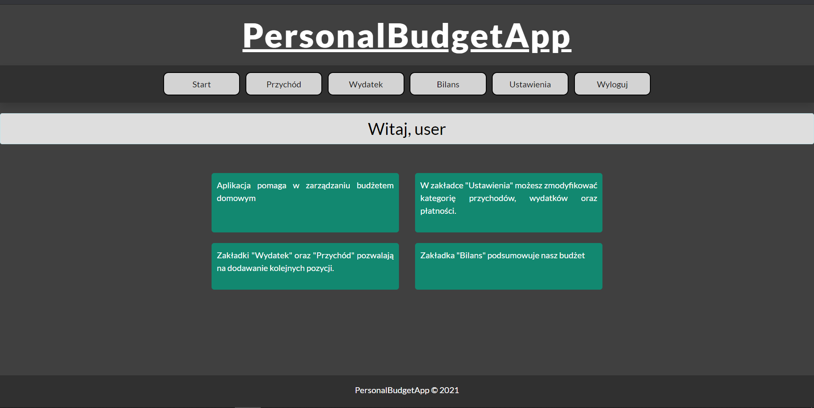

# Personal Budget App

## Table of contents
* [General Info](#general-information)
* [Technologies Used](#technologies-used)
* [Features](#features)
* [Screenshots](#screenshots)
* [Setup](#setup)
* [Project Status](#project-status)
* [To do](#to-do)
* [Acknowledgements](#acknowledgements)


## General info
This is my first Django web application which I created for learning purpose.
Main goal is to allow users to better manage their personal budget by tracing all expenses and incomes. 
Checkout live demo !!! 
https://budgetdjangoapp.herokuapp.com/login/  
user: 'User'  
password: 'testing321  


## Technologies
- Python 3.8.5
- Django 3.2.5
- Bootstrap 5
- SQLite 3
- PostgreSQL
- jQuery

## Features
- Create your own expences and incomes category
- Select from diffrent paymant methods and add your own.
- Trace your expences on pie chart.

## Screenshots


## Setup
- Clone the repository 
```
git clone https://github.com/L0czi/Personal_Budget.git
```

- Create your own virtual environment
```
python3 -m venv venv
source venv/bin/activate
```

- Install requirements
```
pip install -r requirements.txt
```

- Make your migrations
```
python manage.py makemigrations
python manage.py migrate
```

- Create a new superuser
```
python manage.py createsuperuser
```

- Final checks
```
python manage.py runserver
```
- Open in your browser
```
http://127.0.0.1:8000/
```

## Project Status
Project is:  _in progress_ 

## To do:
- Possibility to change period of time in balance page
- ...

## Acknowledgements
- This project was based on [this project](https://www.youtube.com/watch?v=HAiIemkzTh4)
